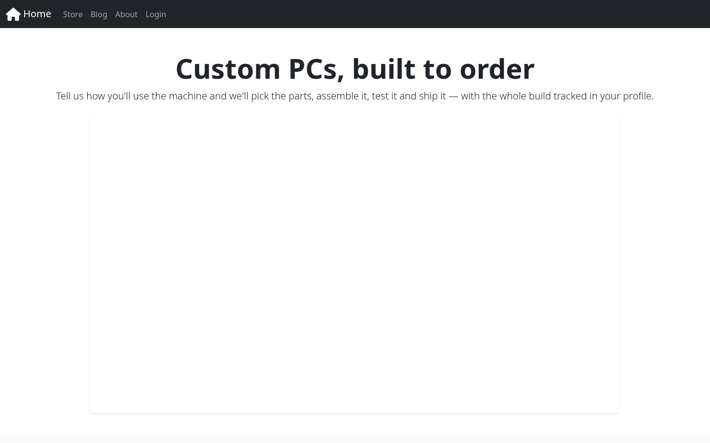
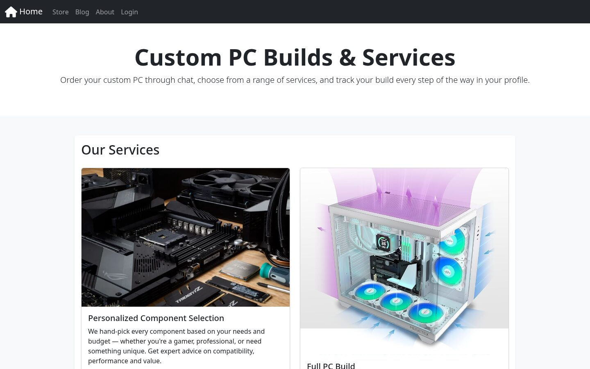
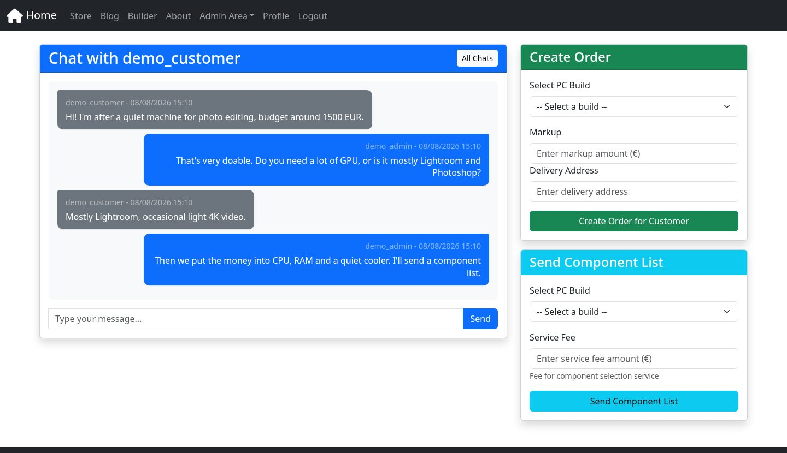
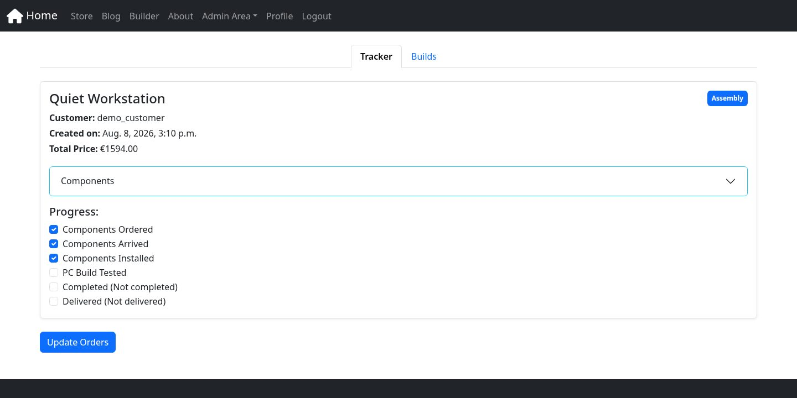
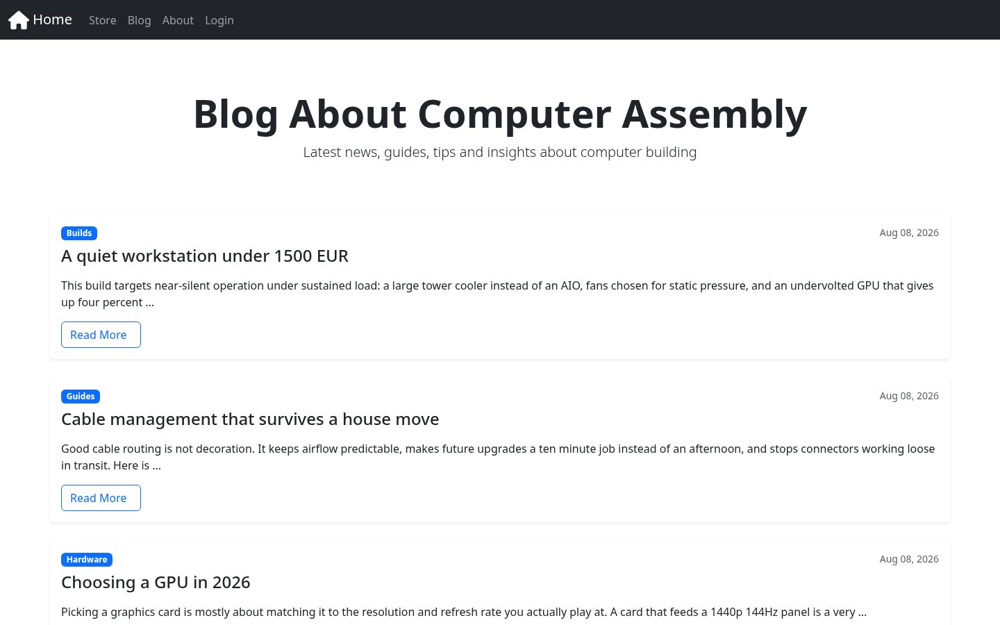

# 🖥️ Django PC Builder

[](https://github.com/koskrub-15/django-pc-builder/actions/workflows/ci.yml)
[](https://codecov.io/gh/koskrub-15/django-pc-builder)

A PC building service, order tracker, real-time chat, and blog — one Django
application, served over both WSGI and ASGI behind Nginx.

---

## 🚀 Overview

**Django PC Builder** is a shop for custom PC builds. An admin assembles builds
from a component catalogue and quotes them to a customer _inside a live chat_;
the customer watches the order move through assembly on a progress tracker and
gets an email at each milestone.

### ✨ Key Features

- **🧩 PC Builder & Quoting**: admins manage a component catalogue and compose
  builds; totals are computed from components plus a per-order markup.
- **💬 Real-Time Chat**: WebSocket chat (Django Channels + Redis) between
  customer and admin. Admins can push a priced component breakdown or open a
  real order straight from the conversation.
- **📦 Order Tracking**: a five-stage tracker (ordered → arrived → installed →
  tested → delivered) that emails the customer when a build is completed and
  when it ships.
- **📝 Blog**: posts, categories, and comments — comments are open to guests.
- **🔐 Authentication**: registration, login, and profile via `django-allauth`.
- **🐳 Dockerized**: Nginx + Gunicorn + Daphne + PostgreSQL + Redis, one command.

### 🛠️ Tech Stack

- **Framework**: [Django 5.2](https://www.djangoproject.com/)
- **WebSockets**: [Django Channels](https://channels.readthedocs.io/) + Daphne
- **Database**: PostgreSQL · **Channel layer**: Redis
- **Auth**: [django-allauth](https://allauth.org/)
- **Environment**: [uv](https://github.com/astral-sh/uv) & [Docker](https://www.docker.com/)

---

## 📸 Screenshots

|                                                       |                                     |
| :---------------------------------------------------: | :---------------------------------: |
|                            |         |
|                      _Homepage_                       |           _Services page_           |
|                  |  |
| _Live chat, with the admin's order and quoting panel_ |       _Order tracker (staff)_       |
|                                |                                     |
|                _Blog with categories_                 |                                     |

---

## 🏗️ Architecture

HTTP and WebSocket traffic are served by two different processes. Nginx is the
single entry point and decides which one gets the request:

```
                       ┌──────────────────┐
   browser ──────────▶ │   Nginx  (8080)  │
                       └────────┬─────────┘
              /static/ /media/  │  /ws/            everything else
             (served by nginx)  │  ▼                      ▼
                                │ ┌──────────────┐  ┌──────────────┐
                                │ │   app-asgi   │  │   app-wsgi   │
                                │ │   Daphne     │  │   Gunicorn   │
                                │ │    :8001     │  │    :8000     │
                                │ └──────┬───────┘  └──────┬───────┘
                                │        │                 │
                                │        ▼                 ▼
                                │  ┌──────────┐      ┌────────────┐
                                └─▶│  Redis   │      │ PostgreSQL │
                                   │ (layer)  │      └────────────┘
                                   └──────────┘
```

### Architecture highlights

- **WSGI / ASGI split.** Gunicorn serves ordinary views; Daphne owns `/ws/`.
  Both run the same codebase from the same image, so there is one deployment
  artifact and no duplicated settings.
- **Chat writes go over HTTP, fan-out goes over WebSocket.** `send_message`
  persists the message in a normal POST, then pushes it into the Redis channel
  layer group; every socket subscribed to `chat_<thread_id>` receives it. This
  keeps message persistence inside a request/response cycle you can test with
  the Django test client, while delivery stays real-time.
- **`init` runs migrations once.** A dedicated one-shot service applies
  migrations before the app containers are allowed to start
  (`service_completed_successfully`), so two web processes never race to migrate.
- **Static files are built into a shared volume.** `collectstatic` writes to a
  named volume that Nginx mounts read-only — Django never serves static in
  production.

See [CLAUDE.md](CLAUDE.md) for a deeper tour of the codebase.

---

## ⚡ Quick Start

> `just` is a convenience wrapper. If you don't have it installed, use the plain
> `docker compose` / `uv` commands below — they do the same thing.

### 🏃 With `just`

```shell
just d-up          # configure, build, migrate, and start everything
```

Then open **http://localhost:8080**.

To wipe every container, volume, and image and start clean:

```shell
just d-purge
```

### 🐳 Plain commands (no `just`)

```bash
# 1. Configure environment
cp .env.example .env                                # then edit the secrets
cp compose.override.dev.yaml compose.override.yaml

# 2. Build and start the full stack
COMPOSE_PROFILES=full_dev USER_ID=$(id -u) docker compose up --build
```

`USER_ID` is used both as the image's build arg and as the runtime user, so
files written into the bind-mounted source tree stay owned by you.

### 🐍 Without Docker

You need your own PostgreSQL and Redis, pointed at by `.env`:

```bash
uv sync
uv run python manage.py migrate
uv run python manage.py runserver     # → http://localhost:8000
```

### 👤 Create an admin

The builder, the order tracker, and the chat thread list are staff-only:

```bash
docker compose exec app-wsgi python manage.py createsuperuser
```

---

## 🛠️ Development

### Install just

You must have [just] installed on your system to run different commands.

- [just.just](just/dev/just.just)

After installing [just], you can see all available commands with:

```bash
just --list
```

[just]: https://github.com/casey/just

### Initialize development environment

Create venv, register pre-commit hooks, and install dependencies:

```bash
just init-i-dev

# or, without just:
uv sync
uv run pre-commit install
```

### Lint & type-check

```bash
just pre-commit-i-run-i-all
```

`ruff`, `ruff-format`, `mypy`, `djlint`, and `prettier` all run here — the same
set CI enforces.

---

## 🧪 Testing

Tests run against `core.test_settings`: in-memory SQLite, an in-memory channel
layer, and a locmem email backend. No `.env`, no Postgres, no Redis needed.

```bash
just test-i-run              # the whole suite
just test-i-coverage         # with a per-file coverage report
just test-i-path apps.chat   # one app
just test-i-docker-run       # inside the running container

# or, without just:
uv run python manage.py test apps --settings=core.test_settings
```

CI additionally enforces a **90% coverage floor** on every push and pull request.

---

## 🐳 Docker

| Command                  | What it does                                         |
| ------------------------ | ---------------------------------------------------- |
| `just d-up`              | Build and start the full stack                       |
| `just d-up-i-watch`      | Same, with live sync/rebuild on file changes         |
| `just d-build`           | Build images only                                    |
| `just d-compose-inspect` | Print the merged compose configuration               |
| `just d-purge`           | Remove containers, volumes, and locally built images |

Published ports in dev: Nginx `8080`, PostgreSQL `55432`, Redis `6380`.

---

## 📁 Project Structure

```
apps/
  about/       — about page + contact form
  base/        — homepage
  blog/        — posts, categories, comments
  builder/     — components, builds, orders, progress tracker
  chat/        — real-time WebSocket chat (admin ↔ customer)
  profile/     — user order history
  store/       — services, ordering steps and FAQ page
  templates/   — all HTML templates (shared across apps)
core/
  settings.py       — main settings
  test_settings.py  — no-setup settings for the test suite
  urls.py           — root URL config
  asgi.py           — ASGI app with WebSocket routing
docker/
  app/         — entrypoint and start scripts (wsgi, asgi, init)
  nginx/       — reverse proxy configuration
just/          — task runner recipes (see `just --list`)
```

---

## 🤝 Contributing

See [CONTRIBUTING.md](CONTRIBUTING.md). Issues and pull requests are welcome.

## 📄 License

[MIT](LICENSE)
